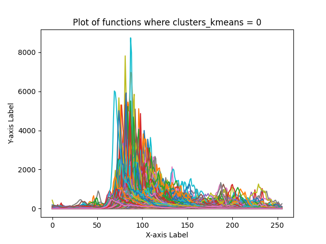
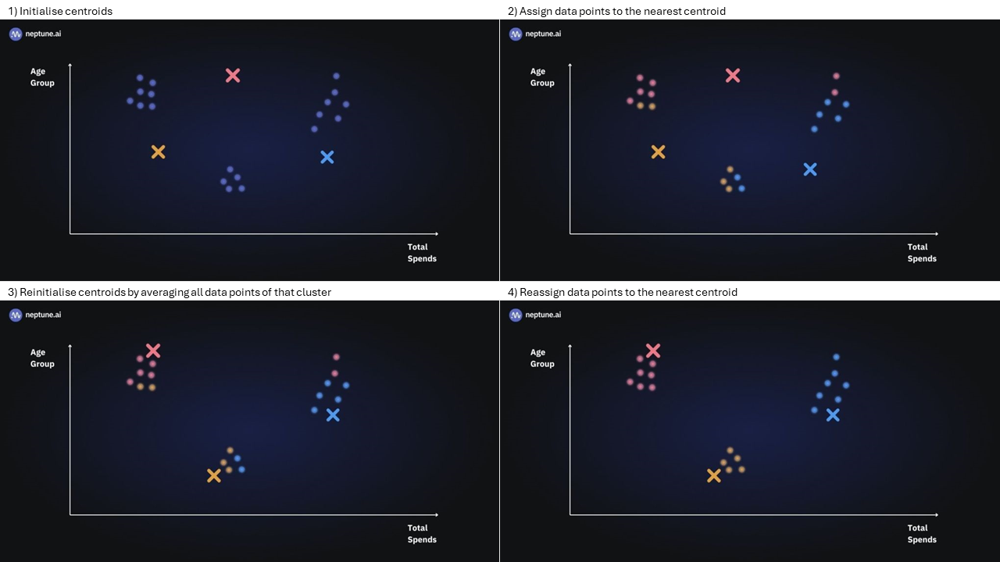
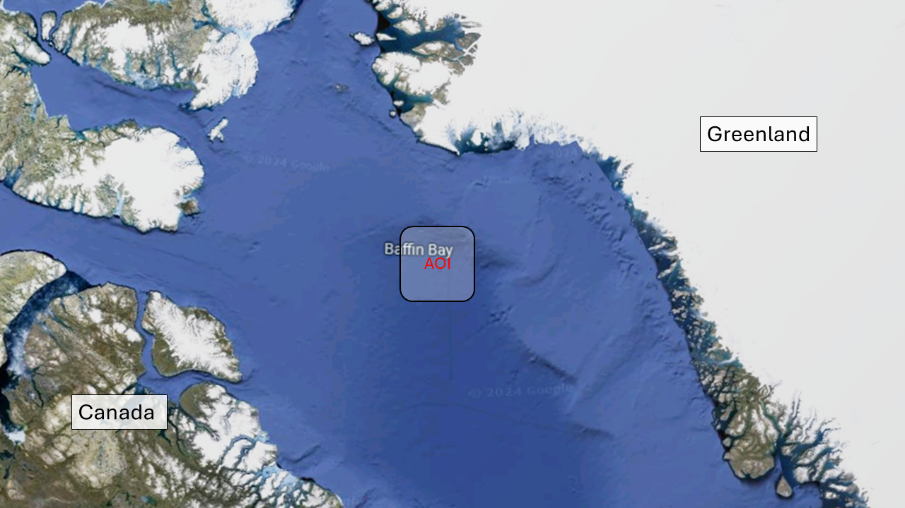
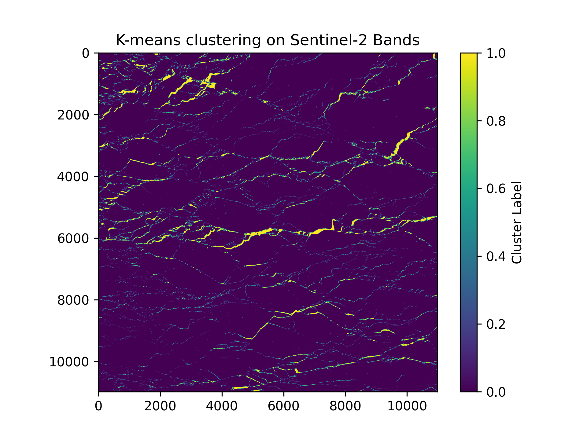
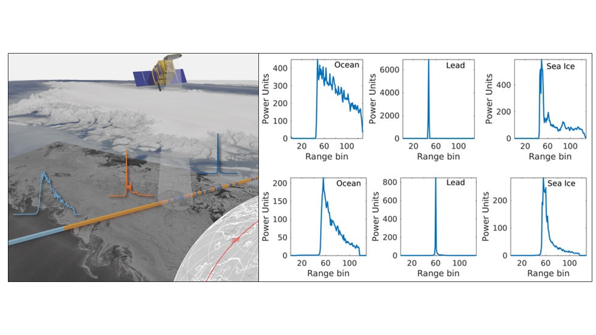
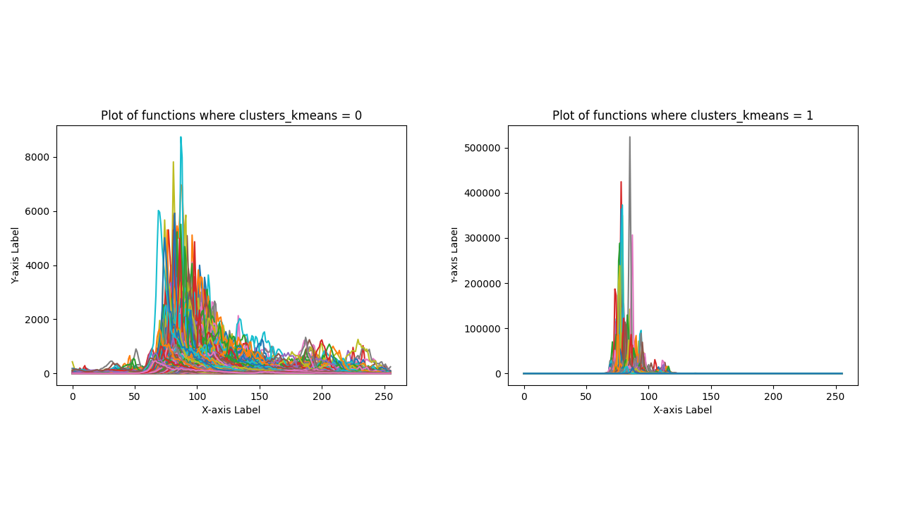
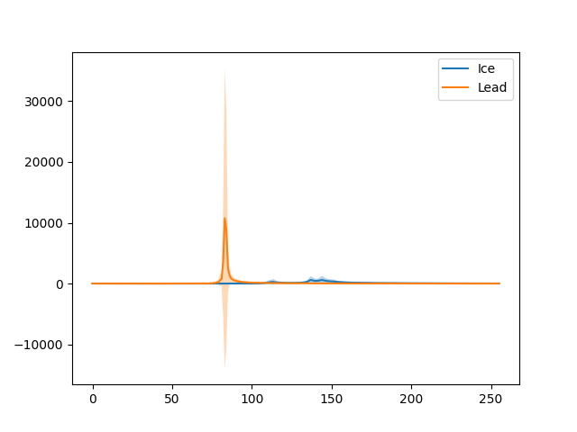
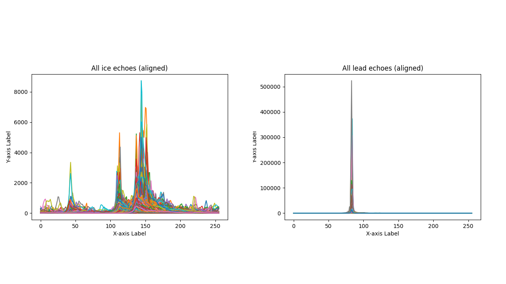
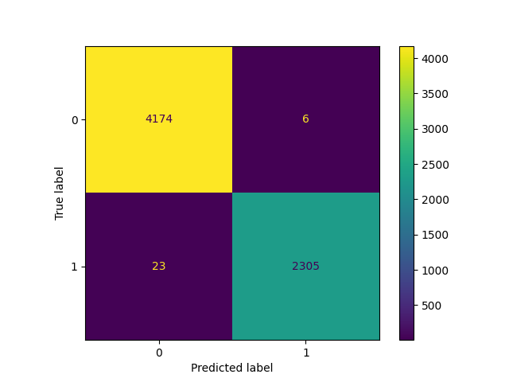

# GEOL0069-EOYA
<!-- Back to top link -->
<a name="readme-top"></a>

<br />
<div align="center">
  <a href="https://github.com/affan1317/GEOL0069-EOYA">
    
  </a>
  
  <h3 align="center">Sea-ice and lead unsupervised classification</h3>

  <p align="justify">
    This project focuses on unsupervised classification of sea ice and lead. K-means method of classification is applied to the high-resolution Sentinel-2 optical image and the collocated Sentinel-3 altimetry data and compare the results with the ground truth (classification by ESA).
  </p>
</div>

<!-- TABLE OF CONTENTS -->
<details>
  <summary>Table of Contents</summary>
  <ol>
    <li>
      <a href="#k-means-clustering">K-means Clustering</a>
    </li>
    <li>
      <a href="#getting-started">Getting Started</a>
      <ul>
        <li><a href="#installation">Installation</a></li>
      </ul>
    </li>
    <li><a href="#where-are-we">Where are we?</a></li>
    <li><a href="#sentinel-2-optical-image-classification">Sentinel-2 optical image classification</a></li>
    <li><a href="#sentinel-3-altimetry-data-classification">Sentinel-3 altimetry data classification</a></li>
    <li><a href="#evaluation">Evaluation</a></li>
    <li><a href="#contact">Contact</a></li>
    <li><a href="#acknowledgments">Acknowledgments</a></li>
    <li><a href="#references">References</a></li>
  </ol>
</details>

<!-- INTRODUCTION -->
# K-means Clustering
K-means clustering is a type of unsupervised learning algorithm used for partitioning a dataset into a set of k groups (or clusters), where k represents the number of groups pre-specified by the analyst. It classifies the data points based on the similarity of the features of the data[^1]. The basic idea is to define k centroids, one for each cluster, and then assign each data point to the nearest centroid, while keeping the centroids as small as possible[^2].

<a href="https://github.com/affan1317/GEOL0069-EOYA">
   
</a>
<h3 align="center">Figure 1: Illustration of how K-means classification works [^4]</h3>

## Why K-means for Clustering?
K-means clustering is particularly well-suited for applications where:
- The structure of the data is not known beforehand: K-means doesn’t require any prior knowledge about the data distribution or structure, making it ideal for exploratory data analysis.
- Simplicity and scalability: The algorithm is straightforward to implement and can scale to large datasets relatively easily.

## Key Components of K-means
- Choosing K: The number of clusters (k) is a parameter that needs to be specified before applying the algorithm.
- Centroids Initialization: The initial placement of the centroids can affect the final results.
- Assignment Step: Each data point is assigned to its nearest centroid, based on the squared Euclidean distance.
- Update Step: The centroids are recomputed as the center of all the data points assigned to the respective cluster.

## The Iterative Process of K-means
The assignment and update steps are repeated iteratively until the centroids no longer move significantly, meaning the within-cluster variation is minimised. This iterative process ensures that the algorithm converges to a result, which might be a local optimum [^4].

## Advantages of K-means
- Efficiency: K-means is computationally efficient.
- Ease of interpretation: The results of k-means clustering are easy to understand and interpret.

<p align="right">(<a href="#readme-top">back to top</a>)</p>

<!-- GETTING STARTED -->
# Getting started
This project is created using Google Colab, which is a cloud-based platform for writing, running, and sharing Python code collaboratively. Colab seamlessly integrates with Google Drive for easy storage and sharing of notebooks. It provides free access to powerful GPU and TPU resources, eliminating the need for expensive hardware. However, with the free version of Google Colab, the RAM is limited to 12.7 Gb so we will not be able to run processes that are computationally intensive. To access the notebook, you can just click the Google Colab link in the ipynb files included in this repo. Several ipynb files are set up, dividing the steps into smaller chunks to avoid overcrowding in the codes.

## Installation

Below are the packages needed for this project
   ```sh
!pip install rasterio
!pip install netCDF4
!pip install basemap
!pip install cartopy

   ```
The Sentinel-2 and Sentinel-3 data folders used in this project are obtained from the Copernicus Data Space and can be viewed in the [online catalog](https://browser.dataspace.copernicus.eu/?zoom=10&lat=74.28226&lng=-67.12852&themeId=DEFAULT-THEME&visualizationUrl=https%3A%2F%2Fsh.dataspace.copernicus.eu%2Fogc%2Fwms%2F274a990e-7090-4676-8f7d-f1867e8474a7&datasetId=S2_L1C_CDAS&fromTime=2024-03-04T00%3A00%3A00.000Z&toTime=2024-03-04T23%3A59%3A59.999Z&layerId=1_TRUE_COLOR&demSource3D=%22MAPZEN%22&cloudCoverage=30&dateMode=SINGLE). The folders are not included in this repo because the size is too large. However, the extraction processes are outlined in the Data Fetching ipynb file. The following are the names of the Sentinel-2 and Sentinel-3 data folders, but the codes should be applicable for other places and times as well.

- Sentinel-2 optical data : S2A_MSIL1C_20240304T171211_N0510_R112_T19XEC_20240304T192251.SAFE
- Sentinel-3 OLCI data : S3B_OL_1_EFR____20240304T155608_20240304T155711_20240305T084636_0063_090_211_1620_PS2_O_NT_003.SEN3
- Seninel-3 altimetry data : S3B_SR_2_LAN_SI_20240304T154612_20240304T160309_20240328T201933_1016_090_211______PS2_O_NT_005.SEN3

<p align="right">(<a href="#readme-top">back to top</a>)</p>

# Where are we?
The selected location for this project is in the Baffin Bay, the stretch of sea between Greenland and Canada. The sea is frozen a majority period of the year, but there is still movement in the sea ice, creating those leads. The images that we are looking into today is from the 4th of May 2024, which we can also tell by the folder names. It is useful to note that the sensing time of the Sentinel-2 and Sentinel-3 data are separated by a few hours.

<a href="https://github.com/affan1317/GEOL0069-EOYA">
   
</a>
<h3 align="center">Figure 2: Location of the area of interest</h3>


<p align="right">(<a href="#readme-top">back to top</a>)</p>

<!-- S2 -->
# Sentinel-2 optical image classification
Sentinel-2 provides an optical image of the location, composed of 110x110 km2 tiles (ortho-images in UTM/WGS84 projection). K-means classification is used to discriminate lead from sea ice, and below is the result. The algorithm did a great job capturing the narrow leads running through the sea ice. An important thing to note here is that the condition for this area at this specific time is almost cloudless, thus the good result. Therefore, when this simple K-means classification is applied to cloudy image, the result might not be as good as the algorithm might group the white clouds together with the sea ice and not detect the leads underneath.

<a href="https://github.com/affan1317/GEOL0069-EOYA">
   
</a>
<h3 align="center">Figure 3: K-means classification results for the area of interest</h3>


<p align="right">(<a href="#readme-top">back to top</a>)</p>

<!-- S3 -->
# Sentinel-3 altimetry data classification
The shape of altimetry waveforms strongly depend on the surface characteristics. Major differences can be seen in terms of power magnitudes, number and shape of signal peaks [^3]. Leads produce narrow waves with very high power magnitude due to the calm and flat water. On the other hand, signal reflected from the ocean and sea ice are wider, noisier, and tend to have more peaks. This is because they are subjected to movement caused by waves and/or ice floes. The clear differences allow the classification of these surfaces using altimetry data.

<a href="https://github.com/affan1317/GEOL0069-EOYA">
   
</a>
<h3 align="center">Figure 4: Waveform examples for Envisat (top row) and SARAL (bottom row) for three different surface scatterers: Ocean (left), Lead (middle), and Sea Ice (right) [^3] </h3>


In this project, we will be considering the two classes that are relevant to our selected area of interest - sea ice and lead. The echoes are classified using the K-means algorithm, and the results are shown in Figure 5. The shapes of the echoes are pretty much the same with the ones in Figure 4, showing that the algorithm is reliable to classify sea ice and lead. However, in cases where three or four classes need to be classified, further refinements need to be made.

<a href="https://github.com/affan1317/GEOL0069-EOYA">
   
</a>
<h3 align="center">Figure 5: Classified echoes from altimetry data</h3>


<p align="right">(<a href="#readme-top">back to top</a>)</p>

<!-- Evaluation -->
# Evaluation
The echoes are then aligned for mean and standard deviation calculation. In Figure 6, we can see the obvious difference between the mean power magnitude of lead that is significantly higher than that of sea ice. The standard deviation is also way higher for lead compared to sea ice. The resulting mean and standard deviation of lead echoes are characteristic of the specular scattering of calm water. However, the sea ice mean echo shows a different shape than what we would expect. On top of that, the mean is shifted quite a bit to the right.

<a href="https://github.com/affan1317/GEOL0069-EOYA">
   
</a>
<h3 align="center">Figure 6: Mean and standard deviation of aligned echoes class</h3>


Upon closer inspection, the source of the error comes not from the classification algorithm, but instead it stems from the method used for aligning the echoes. A shown in Figure 7, the lead echoes are successfully aligned but the sea ice echoes are not. Having that said, the alignment method can be improved to properly align the echoes for better results.

<a href="https://github.com/affan1317/GEOL0069-EOYA">
   
</a>
<h3 align="center">Figure 7: Classified echoes after alignment</h3>


A confusion matrix is constructed comparing the result of K-means classification of altimetry data with the surface type published by the ESA, which is included in the already downloaded altimetry data:

<a href="https://github.com/affan1317/GEOL0069-EOYA">
   
</a>
<h3 align="center">Figure 8: Confusion matrix between the predicted K-means cluster and the ESA true lables </h3>

Most of the K-means classification results agree with the ESA classification, where only 29 pixels were 'wrongly' predicted out of 6508 total pixels, as shown in Figure 8. Therefore, K-means classification for altimetry data is very reliable to distinguish lead from sea ice, provided that there are only two classes.

<p align="right">(<a href="#readme-top">back to top</a>)</p>

<!-- CONTACT -->
# Contact
Affan Mazlan - zcfbabi@ucl.ac.uk / affankb1317@gmail.com

Project Link: [https://github.com/affan1317/GEOL0069-EOYA](https://github.com/affan1317/GEOL0069-EOYA)

<p align="right">(<a href="#readme-top">back to top</a>)</p>

<!-- ACKNOWLEDGMENTS -->
# Acknowledgments
- This project is part of an assignment for module GEOL0069 taught in UCL Earth Sciences Department

# References
[^1]: MacQueen, J., 1967, June. Some methods for classification and analysis of multivariate observations. In Proceedings of the fifth Berkeley symposium on mathematical statistics and probability (Vol. 1, No. 14, pp. 281-297).
[^2]: Abiodun M. Ikotun, Absalom E. Ezugwu, Laith Abualigah, Belal Abuhaija, Jia Heming, 2023. K-means clustering algorithms: A comprehensive review, variants analysis, and advances in the era of big data, Information Sciences, Volume 622, Pages 178-210, ISSN 0020-0255. [https://doi.org/10.1016/j.ins.2022.11.139](https://www.sciencedirect.com/science/article/pii/S0020025522014633)
[^3]: Müller FL, Dettmering D, Bosch W, Seitz F. Monitoring the Arctic Seas: How Satellite Altimetry Can Be Used to Detect Open Water in Sea-Ice Regions. Remote Sensing. 2017; 9(6):551. [https://doi.org/10.3390/rs9060551](https://www.mdpi.com/2072-4292/9/6/551#)
[^4]: Sharma N, 2024. K-Means Clustering Explained, MLOps Blog, last accessed 27/05/2024 [website](https://neptune.ai/blog/k-means-clustering)
