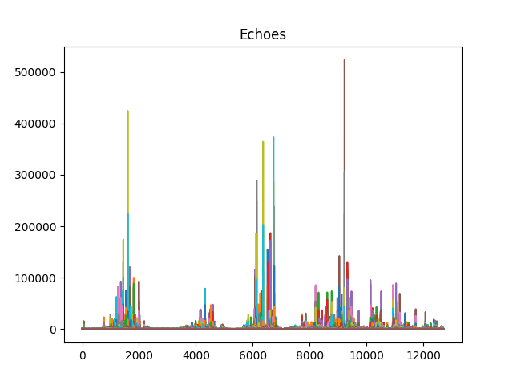

# GEOL0069-EOYA
<!-- Back to top link -->
<a name="readme-top"></a>

<br />
<div align="center">
  <a href="https://github.com/affan1317/GEOL0069-EOYA">
    
  </a>
  
  <h3 align="center">Sea-ice and lead unsupervised classification</h3>

  <p align="justify">
    This project focuses on unsupervised classification of sea ice and lead. K-means method of classification is applied to the high-resolution Sentinel-2 optical image and the collocated Sentinel-3 altimetry data and compare the results with the ground truth (classification by ESA).
  </p>
</div>

<!-- TABLE OF CONTENTS -->
<details>
  <summary>Table of Contents</summary>
  <ol>
    <li>
      <a href="#k-means-clustering">K-means Clustering</a>
    </li>
    <li>
      <a href="#getting-started">Getting Started</a>
      <ul>
        <li><a href="#installation">Installation</a></li>
      </ul>
    </li>
    <li><a href="#where-are-we">Where are we?</a></li>
    <li><a href="#sentinel-2-optical-image">Sentinel-2 Optical Image</a></li>
    <li><a href="#contact">Contact</a></li>
    <li><a href="#acknowledgments">Acknowledgments</a></li>
  </ol>
</details>

<!-- INTRODUCTION -->
# K-means Clustering
K-means clustering is a type of unsupervised learning algorithm used for partitioning a dataset into a set of k groups (or clusters), where k represents the number of groups pre-specified by the analyst. It classifies the data points based on the similarity of the features of the data {cite}macqueen1967some. The basic idea is to define k centroids, one for each cluster, and then assign each data point to the nearest centroid, while keeping the centroids as small as possible.

## Why K-means for Clustering?
K-means clustering is particularly well-suited for applications where:
- The structure of the data is not known beforehand: K-means doesn’t require any prior knowledge about the data distribution or structure, making it ideal for exploratory data analysis.
- Simplicity and scalability: The algorithm is straightforward to implement and can scale to large datasets relatively easily.

## Key Components of K-means
- Choosing K: The number of clusters (k) is a parameter that needs to be specified before applying the algorithm.
- Centroids Initialization: The initial placement of the centroids can affect the final results.
- Assignment Step: Each data point is assigned to its nearest centroid, based on the squared Euclidean distance.
- Update Step: The centroids are recomputed as the center of all the data points assigned to the respective cluster.

## The Iterative Process of K-means
The assignment and update steps are repeated iteratively until the centroids no longer move significantly, meaning the within-cluster variation is minimised. This iterative process ensures that the algorithm converges to a result, which might be a local optimum.

## Advantages of K-means
- Efficiency: K-means is computationally efficient.
- Ease of interpretation: The results of k-means clustering are easy to understand and interpret.

<p align="right">(<a href="#readme-top">back to top</a>)</p>

<!-- GETTING STARTED -->
# Getting started
This project is created using Google Colab, which is a cloud-based platform for writing, running, and sharing Python code collaboratively. Colab seamlessly integrates with Google Drive for easy storage and sharing of notebooks. It provides free access to powerful GPU and TPU resources, eliminating the need for expensive hardware. However, with the free version of Google Colab, the RAM is limited to 12.7 Gb so we will not be able to run processes that are computationally intensive. To access the notebook, you can just click the Google Colab link in the ipynb files included in this repo. Several ipynb files are set up, dividing the steps into smaller chunks to avoid overcrowding in the codes.

## Installation

Below are the packages needed for this project
   ```sh
!pip install rasterio
!pip install netCDF4
!pip install basemap
!pip install cartopy

   ```
The Sentinel-2 and Sentinel-3 data folders used in this project are obtained from the Copernicus Data Space and can be viewed in the [online catalog] (https://browser.dataspace.copernicus.eu/?zoom=10&lat=74.28226&lng=-67.12852&themeId=DEFAULT-THEME&visualizationUrl=https%3A%2F%2Fsh.dataspace.copernicus.eu%2Fogc%2Fwms%2F274a990e-7090-4676-8f7d-f1867e8474a7&datasetId=S2_L1C_CDAS&fromTime=2024-03-04T00%3A00%3A00.000Z&toTime=2024-03-04T23%3A59%3A59.999Z&layerId=1_TRUE_COLOR&demSource3D=%22MAPZEN%22&cloudCoverage=30&dateMode=SINGLE). The folders are not included in this repo because the size is too large. However, the extraction processes are outlined in the Data Fetching ipynb file. The following are the names of the Sentinel-2 and Sentinel-3 data folders, but the codes should be applicable for other places and times as well.

- Sentinel-2 optical data : S2A_MSIL1C_20240304T171211_N0510_R112_T19XEC_20240304T192251.SAFE
- Sentinel-3 OLCI data : S3B_OL_1_EFR____20240304T155608_20240304T155711_20240305T084636_0063_090_211_1620_PS2_O_NT_003.SEN3
- Seninel-3 altimetry data : S3B_SR_2_LAN_SI_20240304T154612_20240304T160309_20240328T201933_1016_090_211______PS2_O_NT_005.SEN3

<p align="right">(<a href="#readme-top">back to top</a>)</p>

# Where is this?
The selected location for this project is in the Baffin Bay, the stretch of sea between Greenland and Canada. The sea is frozen a majority period of the year, but there is still movement in the sea ice, creating those leads. The images that we are looking into today is from the 4th of May 2024, which we can also tell by the folder names. It is useful to note that the sensing time of the Sentinel-2 and Sentinel-3 data are separated by a few hours.

<!-- S2 -->
# Sentinel-2 optical image classification
Sentinel-2 provides an optical image of the location, composed of 110x110 km2 tiles (ortho-images in UTM/WGS84 projection). K-means classification is used to discriminate lead from sea ice, and below is the result.


<p align="right">(<a href="#readme-top">back to top</a>)</p>

<!-- S3 -->
# Sentinel-3 altimetry data classification


<p align="right">(<a href="#readme-top">back to top</a>)</p>

<!-- CONTACT -->
# Contact
Affan Mazlan - zcfbabi@ucl.ac.uk / affankb1317@gmail.com

Project Link: [https://github.com/affan1317/GEOL0069-EOYA](https://github.com/affan1317/GEOL0069-EOYA)

<p align="right">(<a href="#readme-top">back to top</a>)</p>

<!-- ACKNOWLEDGMENTS -->
# Acknowledgments
- This project is part of an assignment for module GEOL0069 taught in UCL Earth Sciences Department
